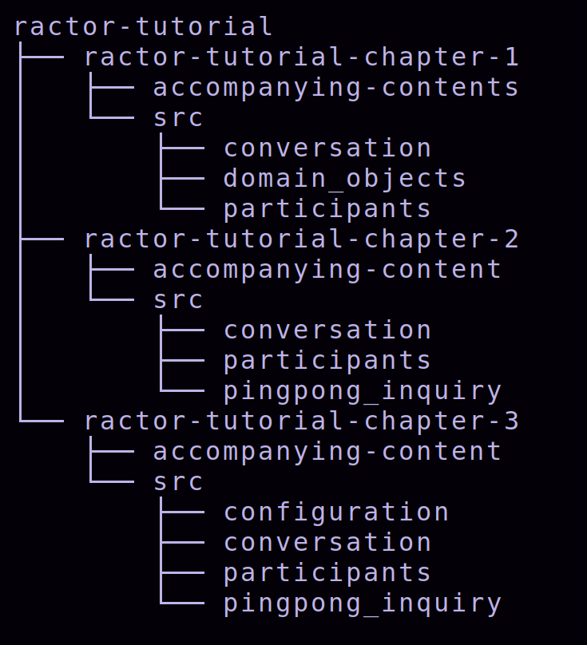

# ractor-tutorial

In the past, I have had the opportunity to learn and apply Actor-based design (using [#akka](https://www.linkedin.com/feed/hashtag/?keywords=akka&highlightedUpdateUrns=urn%3Ali%3Aactivity%3A7092388425978277888) ) in about 3 production software. I loved the way I could model the behaviour using Actors (and [#fsm](https://www.linkedin.com/feed/hashtag/?keywords=fsm&highlightedUpdateUrns=urn%3Ali%3Aactivity%3A7092388425978277888)) using [#scala](https://www.linkedin.com/feed/hashtag/?keywords=scala&highlightedUpdateUrns=urn%3Ali%3Aactivity%3A7092388425978277888) and [#java](https://www.linkedin.com/feed/hashtag/?keywords=java&highlightedUpdateUrns=urn%3Ali%3Aactivity%3A7092388425978277888).  

As a Rust enthusiast, I was searching for Actor-based libraries and 
chanced upon **ractor** , which mirrored the behavior of Erlang's. 

I have captured my understanding during and after the exploration of 
`ractor` in the form of tutorials; in 3 parts, just so that reading each doesn't become
 too heavy.

This repository contains those 3 tutorials that walks one through the world 
of Actors as implemented by 'ractor' framework.

The tutorials are divided into three parts for easier reading and these are in the following directories:

* ractor-tutorial-chapter-1 ([README](./README.chapter-1.md)).
* ractor-tutorial-chapter-2 ([README](./README.chapter-2.md)).
* ractor-tutorial-chapter-3 ([README](./README.chapter-3.md))

Each of these tutorial-chapters has its `cargo.toml` and `src` directories. The accompanying blog is inside README, as well as in the directory `accompanying_contents`.

In order to run the code, one needs to move to the corresponding directory and issue the command: `cargo run`.
